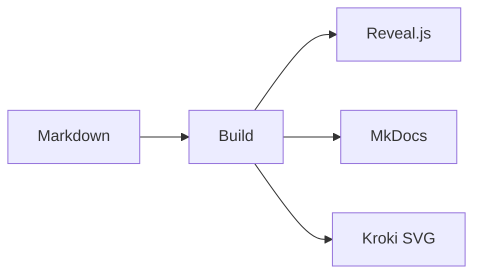

# LuCiDoc en pratique
Un seul lecteur pour les supports de l’équipe

---

## Un build local

- Sources Markdown et AsciiDoc
- Rendu servi sur le réseau Docker local
- Aucun CDN au démarrage

---

## Étapes du build

- Lire le contenu <!-- .element: class="fragment" -->
- Rendre les diagrammes avec Kroki <!-- .element: class="fragment" -->
- Publier le site HTML <!-- .element: class="fragment" -->

