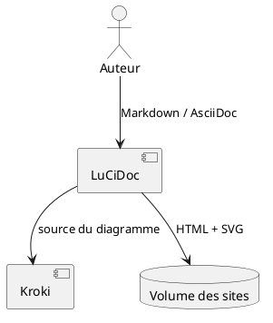

# Guide de l’équipe

Cette documentation est construite par MkDocs Material. Les images et scripts du site sont servis localement.

## Vue d’ensemble

Consultez aussi [le guide de contribution](contributing.html).
